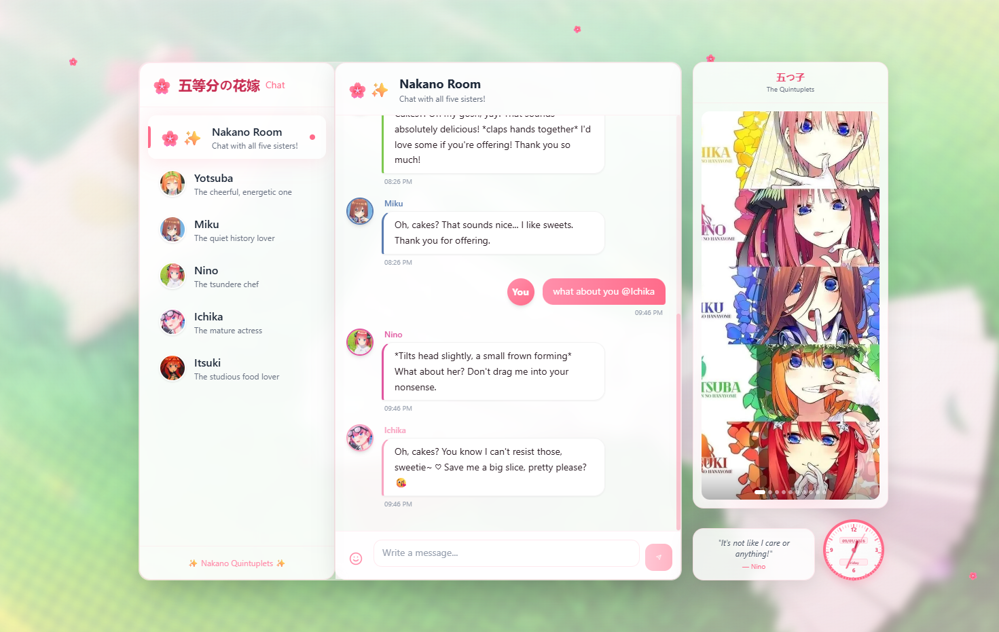
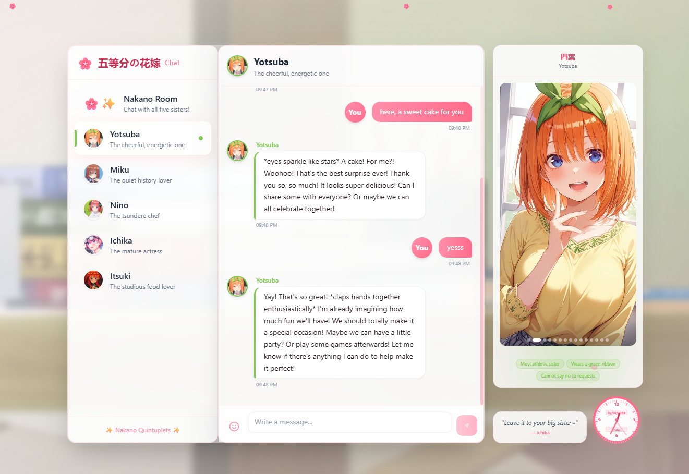
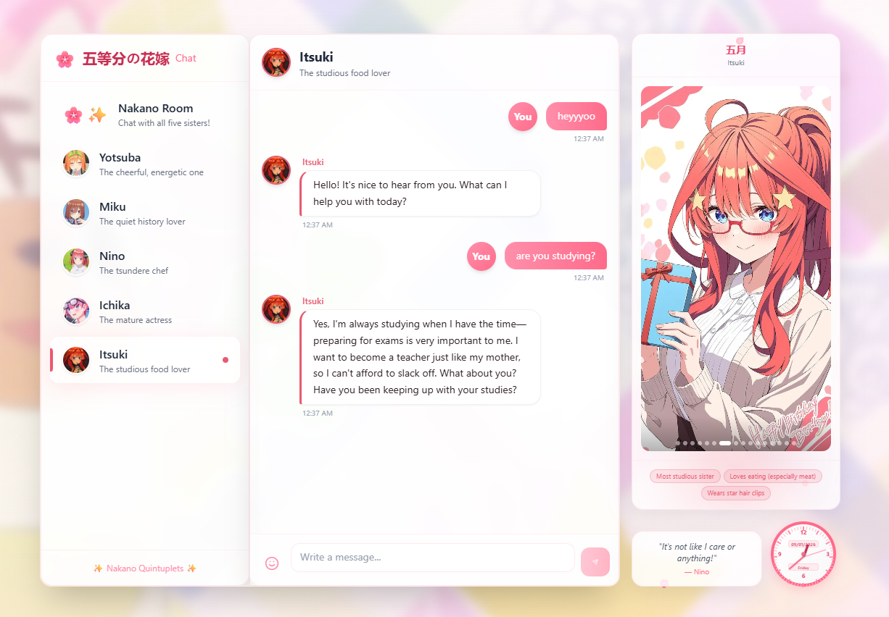

# 🌸 Nakano Room - Chat with the Quintuplets! 

Welcome to **Nakano Room** – your cozy corner to hang out and chat with the five adorable Nakano sisters from *The Quintessential Quintuplets*! 

Whether you want to talk about history with Miku, get cooking tips from Nino, or just have fun with Yotsuba's endless energy, this app brings the quintuplets to life with AI-powered conversations.

---

## ✨ What is this?

Nakano Room is a beautifully designed chat application where you can:

- 💬 **Chat with each sister individually** - Have one-on-one conversations with Ichika, Nino, Miku, Yotsuba, or Itsuki
- 🌸 **Group chat with all five** - Watch them interact and respond together in the Nakano Room
- 🎬 **Animated video wallpaper** - Enjoy the anime openings playing in the background
- 🎵 **Background music** - Listen to the OPs while you chat (with mute toggle!)
- 📸 **Beautiful image slideshows** - Each character has their own gallery rotating in the side panel

---

## 📸 Screenshots

### Chat with All Five Sisters


### Individual Character Chats



### Beautiful UI Details




---

## 🎭 Meet the Sisters

| Sister | Personality | Fun Fact |
|--------|-------------|----------|
| 🎭 **Ichika** | Mature & flirty actress | Always calls you "sweetie" ♡ |
| 🦋 **Nino** | Tsundere chef | "It's not like I care or anything!" |
| 🎧 **Miku** | Shy history nerd | Can talk about Sengoku warlords for hours |
| 🍀 **Yotsuba** | Energetic cheerleader | Never says no to helping! |
| ⭐ **Itsuki** | Studious foodie | Gets VERY excited about meat |

---

## 🌟 Features

### @Mentions
Type `@` to mention specific sisters! They'll definitely respond when you call them out.

### Character Slideshows  
Each sister has their own image gallery that rotates every 5 seconds with smooth transitions.

### Animated Background
The anime OPs (OP1, OP2, OP3) play on loop as your wallpaper with gentle blur effect.

### Real-time Clock & Quotes
A cute analog clock and rotating character quotes decorate the corner.

---

## 🛠️ Setup (For Developers)

Want to run this yourself? Here's how:

### Prerequisites
- Node.js 18+ 
- npm or yarn
- An LLM API key (ZenMux, OpenAI, etc.)

### Installation

```bash
# Clone the repository
git clone https://github.com/your-username/NakanoRoom.git
cd NakanoRoom

# Install dependencies
npm install

# Set up environment variables
cp .env.example .env.local
# Edit .env.local with your API keys
```

### Environment Variables

Create a `.env.local` file with:

```env
ZENMUX_API_KEY=your_api_key_here
ZENMUX_BASE_URL=https://zenmux.ai/api/v1

# Optional: Per-character API keys for more variety
ICHIKA_API_KEY=your_key
NINO_API_KEY=your_key
MIKU_API_KEY=your_key
YOTSUBA_API_KEY=your_key
ITSUKI_API_KEY=your_key
```

### Run Locally

```bash
# Development mode
npm run dev

# Open http://localhost:3000
```

### Deploy to Vercel

```bash
# Install Vercel CLI
npm install -g vercel

# Deploy
vercel
```

Don't forget to add your environment variables in the Vercel dashboard!

---

## 💕 Credits

- **The Quintessential Quintuplets** (五等分の花嫁) - Original anime/manga
- Built with **Next.js**, **Tailwind CSS**, and **Motion.dev**
- Powered by LLM APIs for character conversations

---

## 📝 License

This is a fan project made with love for the Nakano sisters! 🌸

*Not affiliated with the official Quintessential Quintuplets franchise.*

---

Made with 💖 by fans, for fans.
