# 🌸 Nakano Room - Chat with the Beautiful Quintuplets!

<div align="center">
  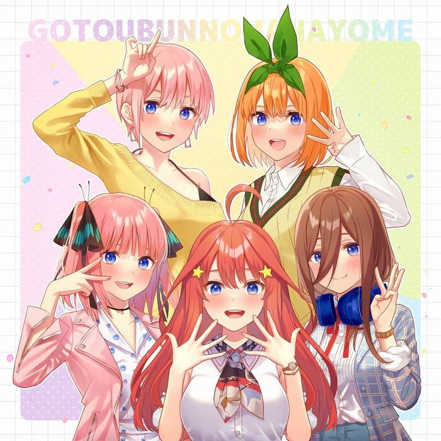
  
  *Your cozy corner to hang out and chat with the five adorable Nakano sisters!*
</div>

---

Welcome to **Nakano Room** – an AI-powered chat application where you can hang out with the Nakano quintuplets from *The Quintessential Quintuplets* (五等分の花嫁)!

Whether you want to talk about history with Miku, get cooking tips from Nino, or just have fun with Yotsuba's endless energy, this app brings the quintuplets to life with AI-powered conversations.

---

## ✨ Features

| Feature | Description |
|---------|-------------|
| 💬 **Individual Chats** | One-on-one conversations with each sister |
| 🌸 **Group Chat** | Chat with all five sisters at once in the Nakano Room |
| 📱 **Mobile App** | Native Android APK with Capacitor |
| 🎬 **Animated Wallpaper** | Anime OPs playing as background video |
| 🎵 **Background Music** | Listen to OPs with mute toggle |
| 📸 **Image Galleries** | Rotating character slideshows |
| 💬 **Context Menus** | Right-click (desktop) or tap interactions (mobile) |
| ↩️ **Reply Feature** | Quote and reply to any message |
| 😊 **Emoji & Kaomoji** | Quick emoji picker with cute kaomoji |
| @️ **Mentions** | Type `@` to mention specific sisters |

---

## 📸 Screenshots

<div align="center">

### Welcome Screen
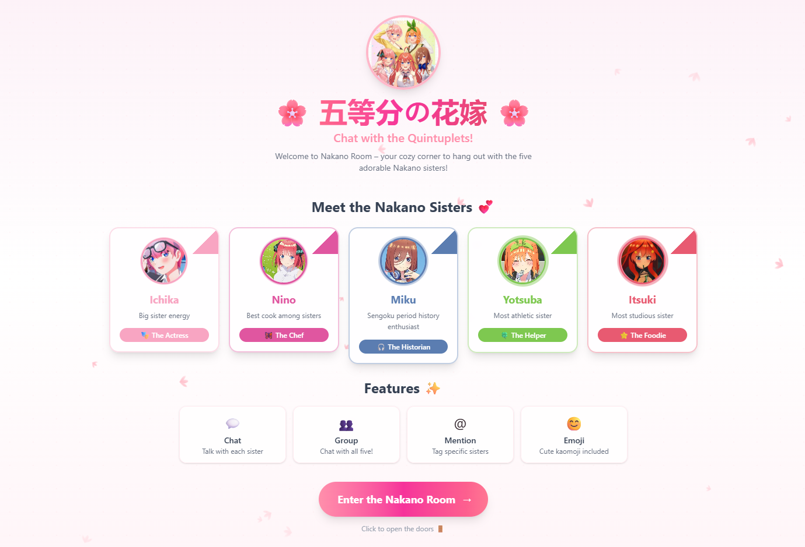

### Desktop View - Group Chat


### Individual Character Chats
<table>
<tr>
<td></td>
<td>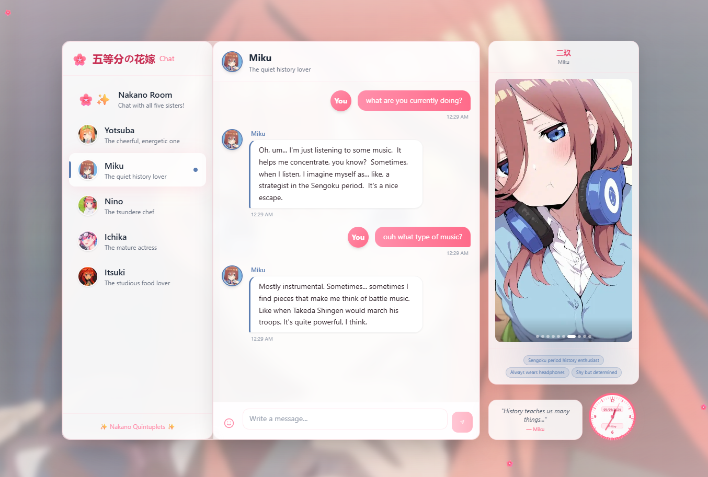</td>
</tr>
<tr>
<td>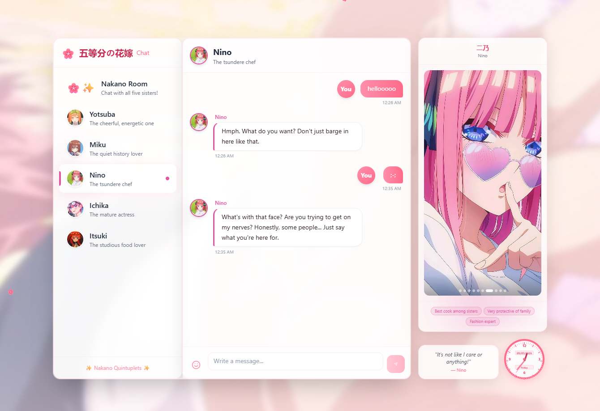</td>
<td>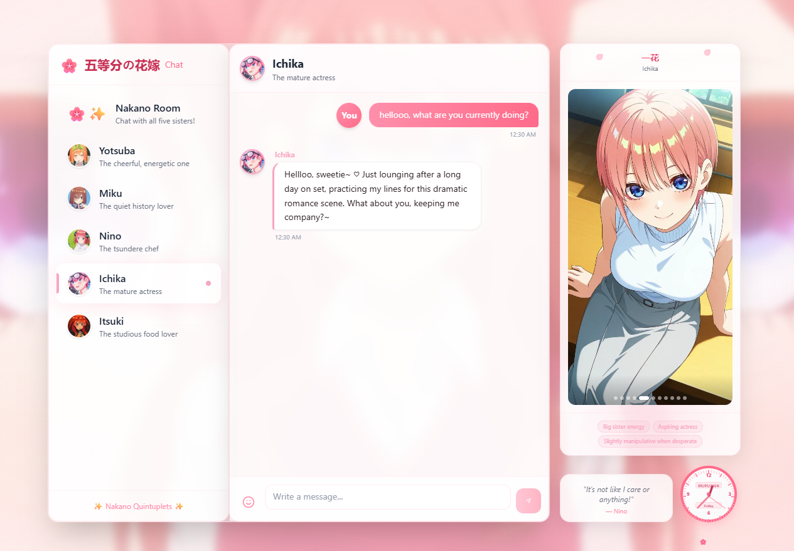</td>
</tr>
</table>

</div>

---

## 🎭 Meet the Nakano Sisters

<table>
<tr>
<td align="center" width="20%">
<br/>
<b>🎭 Ichika</b><br/>
<sub>The Eldest Sister</sub>
</td>
<td align="center" width="20%">
<br/>
<b>🦋 Nino</b><br/>
<sub>The Tsundere Chef</sub>
</td>
<td align="center" width="20%">
<br/>
<b>🎧 Miku</b><br/>
<sub>The Quiet Historian</sub>
</td>
<td align="center" width="20%">
<br/>
<b>🍀 Yotsuba</b><br/>
<sub>The Energetic Helper</sub>
</td>
<td align="center" width="20%">
<br/>
<b>⭐ Itsuki</b><br/>
<sub>The Studious Foodie</sub>
</td>
</tr>
</table>

### Character Details

| Sister | Color | Personality | Signature Trait |
|--------|-------|-------------|-----------------|
| **Ichika** | 💗 Pink | Mature, flirty, caring | Always calls you "sweetie" ♡ |
| **Nino** | 🦋 Coral | Tsundere, passionate, loyal | "It's not like I care or anything!" |
| **Miku** | 💙 Blue | Shy, nerdy, sweet | Can talk about Sengoku warlords for hours |
| **Yotsuba** | 💚 Green | Energetic, selfless, cheerful | Never says no to helping! |
| **Itsuki** | ⭐ Orange | Studious, honest, hungry | Gets VERY excited about meat 🍖 |

---

## 🧠 How the AI Magic Works

Nakano Room isn't just a simple chatbot – it's an intelligent multi-character AI system where each sister has her own personality, and they're all aware of each other!

### 📖 The Concept: You Are the Tutor

Just like in the anime, **you play the role of the tutor** (like Fuutarou Uesugi). Each sister knows you're their tutor and has her own feelings toward you!

```
      You (The Tutor)
            │
    ┌───────┼───────┐
    │       │       │
    ▼       ▼       ▼
 Ichika  Nino   Miku
 (flirty) (tsundere) (shy)
            │
    ┌───────┴───────┐
    ▼               ▼
 Yotsuba         Itsuki
 (supportive)    (studious)
```

---

## 🏗️ System Architecture

### High-Level Flow

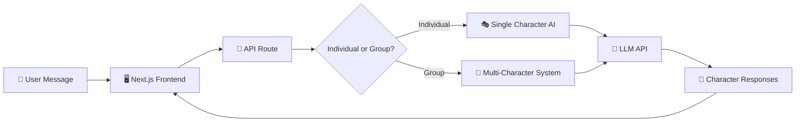

### Individual Chat Flow
When you chat one-on-one with a sister, she responds with her unique personality.

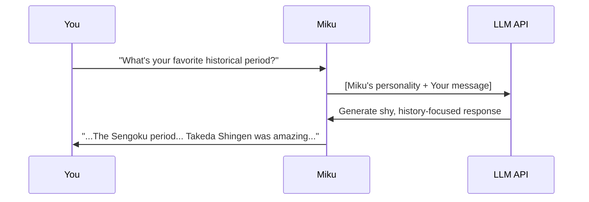

---

## 👥 Group Chat: The Nakano Room

The most exciting feature! When you chat in the group, **all five sisters respond**, and they're aware of what each other said!

### How Group Chat Works

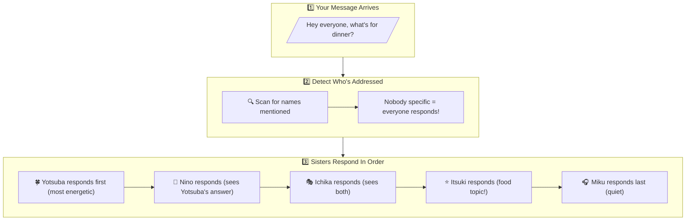

### Sequential Response System

Each sister sees what her sisters said before her, creating natural conversations:

| Order | Sister | She Can See |
|-------|--------|-------------|
| 1st | Yotsuba | Just your message |
| 2nd | Nino | Your message + Yotsuba's reply |
| 3rd | Ichika | Your message + Yotsuba + Nino |
| 4th | Itsuki | Your message + all 3 sisters |
| 5th | Miku | Your message + all 4 sisters |

---

## 🎯 Context Awareness System

A smart system that prevents sisters from "stealing" responses meant for others!

### The Problem We Solved

Without context awareness:
```
You: "That's amazing, Itsuki!!"
Yotsuba: "Thank you so much!" ❌ (Wrong! Itsuki was praised)
```

With context awareness:
```
You: "That's amazing, Itsuki!!"
Itsuki: "Thank you! I worked hard on this!" ✅
Yotsuba: "Way to go, Itsuki!!" ✅ (Cheers for her sister)
```

### How It Works

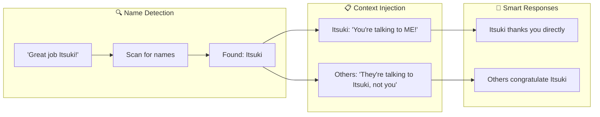

### The Awareness Rules

Each sister follows these rules:
1. ✅ **If addressed directly** → Respond to the message
2. ✅ **If another sister is addressed** → React appropriately (tease, cheer, etc.)
3. ❌ **Never steal compliments** meant for another sister
4. ❌ **Never answer questions** directed at another sister

---

## 🔄 Response Order Logic

The sisters respond in a specific personality-based order:

```
Most Energetic ─────────────────────► Most Quiet

🍀 Yotsuba → 🦋 Nino → 🎭 Ichika → ⭐ Itsuki → 🎧 Miku
   (1st)       (2nd)      (3rd)       (4th)      (5th)
```

This creates natural conversations where:
- **Yotsuba** jumps in first with enthusiasm
- **Nino** reacts (often tsundere-style)
- **Ichika** adds her mature perspective
- **Itsuki** contributes thoughtfully
- **Miku** quietly adds her thoughts last

---

## 🎨 Tech Stack Overview

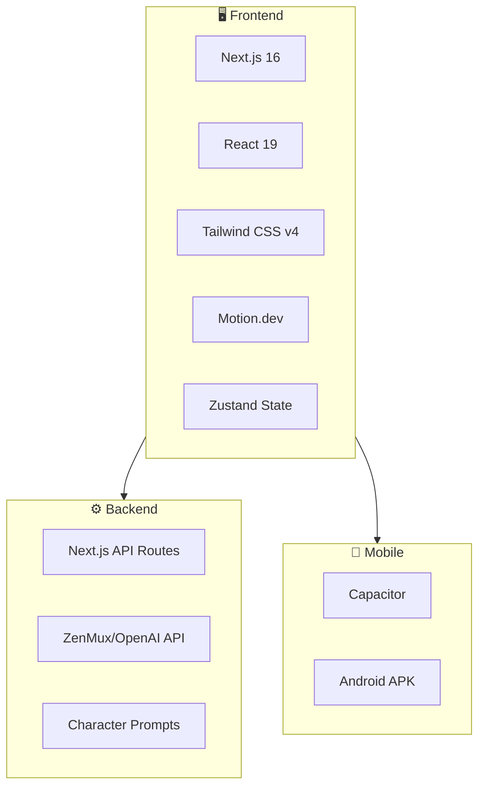

---

## 🛠️ Setup

### Prerequisites
- Node.js 18+
- npm or yarn
- An LLM API key (ZenMux, OpenAI, etc.)
- For Android: Android Studio (for building APK)

### Installation

```bash
# Clone the repository
git clone https://github.com/your-username/NakanoRoom.git
cd NakanoRoom

# Install dependencies
npm install

# Set up environment variables
cp .env.example .env.local
# Edit .env.local with your API keys
```

### Environment Variables

Create a `.env.local` file:

```env
ZENMUX_API_KEY=your_api_key_here
ZENMUX_BASE_URL=https://zenmux.ai/api/v1

# Optional: Per-character API keys
ICHIKA_API_KEY=your_key
NINO_API_KEY=your_key
MIKU_API_KEY=your_key
YOTSUBA_API_KEY=your_key
ITSUKI_API_KEY=your_key
```

### Run Locally

```bash
# Development mode
npm run dev

# Open http://localhost:3000
```

---

## 📱 Building Android APK

This project uses **Capacitor** to build native Android apps.

### Quick Build

```bash
# Build web assets and sync to Android
npm run mobile:build

# Open in Android Studio
npx cap open android
```

### In Android Studio
1. Go to **Build → Build Bundle(s) / APK(s) → Build APK(s)**
2. Wait for build to complete
3. APK location: `android/app/build/outputs/apk/debug/app-debug.apk`

### Command Line Build (Optional)
```bash
cd android
./gradlew assembleDebug
```

---

## 🎮 Usage Guide

### Desktop
- **Right-click** on message bubbles to reply
- **Right-click** on sidebar chats to clear chat
- Type `@` to mention a sister
- Click emoji button for emoji picker

### Mobile
- Tap the **⋮** button on chat list for Clear Chat
- Tap the **↩️** button on messages to reply
- Tap emoji button for quick emoji access

---

## 🚀 Deploy to Vercel

```bash
# Install Vercel CLI
npm install -g vercel

# Deploy
vercel
```

Add your environment variables in Vercel dashboard.

---

## 💕 Credits

- **The Quintessential Quintuplets** (五等分の花嫁) - Original anime/manga by Negi Haruba
- Built with **Next.js 16**, **Tailwind CSS v4**, **Motion.dev**, and **Zustand**
- Native mobile with **Capacitor**
- Powered by LLM APIs for AI conversations

---

## 📝 License

This is a fan project made with love for the Nakano sisters! 🌸

*Not affiliated with the official Quintessential Quintuplets franchise.*

---

<div align="center">
  
Made with 💖 by fans, for fans.

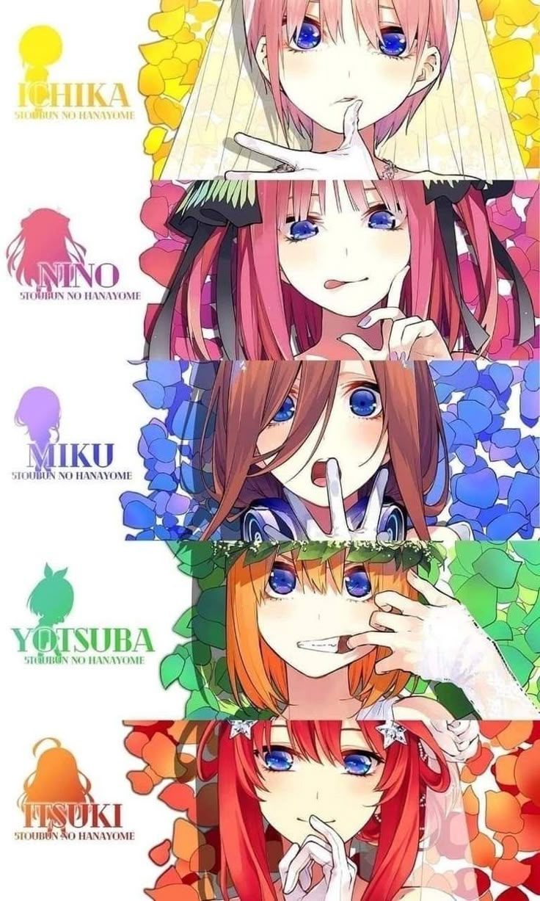

</div>
